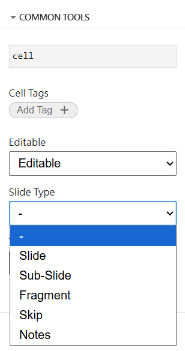
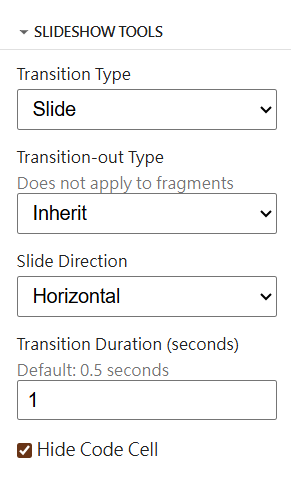
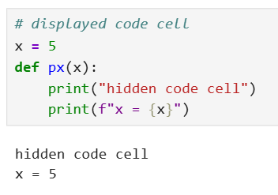
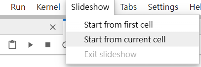
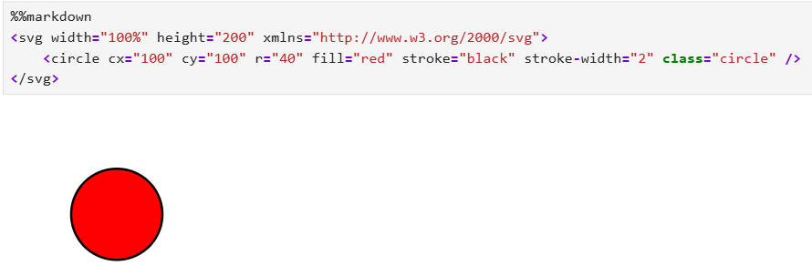
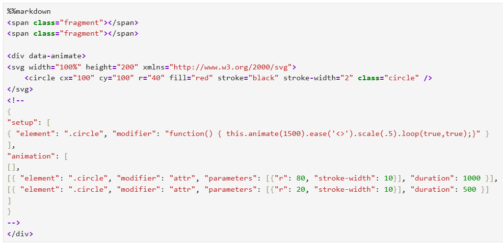
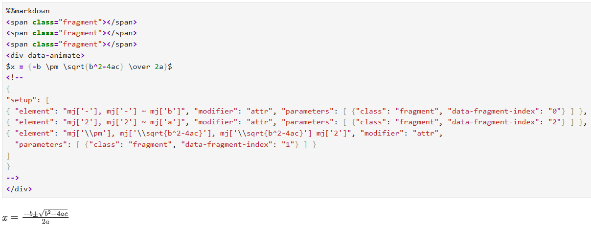

# custom_slideshow

[](https://github.com/ltshum/fyp-custom-slideshow/actions/workflows/build.yml)

JupyterLab extension for animated slideshow.

## Requirements

- JupyterLab >= 4.0.0

## Install

To install the extension, execute:

```bash
pip install custom_slideshow
```

## Uninstall

To remove the extension, execute:

```bash
pip uninstall custom_slideshow
```

## Usage

### Slideshow

The slideshow follows the Reveal.js framework. The slide type of a cell can be changed in `COMMON TOOLS > Slide Type`. Available slide types include **Slide**, **Sub-Slide**, **Fragment**, **Skip**.



The transition type and duration of a cell can be changed in `SLIDESHOW TOOLS`. Available transition types include **Slide**, **Fade**, **Zoom**. The default transition type can be changed in Settings. Transition-out type inherits the transition type by default.

For transition type of **Slide**, the slide direction can be either **Horizontal** or **Vertical**. By default, Slides have horizontal transitions, and Sub-Slides have vertical transitions.



For code cells, the input of the cell can be hidden by checking `Hide Code Cell`, leaving only the output visible.



To start a slideshow, select `Slideshow` in the main menu and select either `Start from first cell` or `Start from current cell`. `Start from first cell` starts the slideshow from the beginning. `Start from current cell` starts the slideshow at the selected cell.

To exit a slideshow, exit fullscreen. The `Exit slideshow` option is an alternative for when exiting fullscreen does not exit the slideshow successfully.



### SVG Animation

The SVG animation feature uses the [Reveal.js Animate and LoadContent plugins by Asvin Goel](https://github.com/rajgoel/reveal.js-plugins). Animations are loaded after starting a slideshow.

To add an SVG image for animating, add `%%markdown` at the start of a code cell, and create a `<div>` block with attribute `data-animate`. Either add the SVG data inside the block, or use the [`data-load` attribute from the LoadContent plugin](https://github.com/rajgoel/reveal.js-plugins/blob/master/loadcontent/README.md).



To animate the SVG image, add a comment block with a JSON string. The `setup` object controls the images after loading. The `animation` object controls the images on each fragment. To successfully set up the animation, the corresponding number of fragments must be added in the cell. More details can be viewed in the [README of the Animate plugin](https://github.com/rajgoel/reveal.js-plugins/blob/master/animate/README.md).



### MathJax SVG

MathJax 4 is installed to convert math expressions into SVG images, which can be used for animations. Components in the SVG image can be selected with selector `g[data-latex='x']`, which is simplified into `mj['x']`.



## Contributing

### Development install

Note: You will need NodeJS to build the extension package.

The `jlpm` command is JupyterLab's pinned version of
[yarn](https://yarnpkg.com/) that is installed with JupyterLab. You may use
`yarn` or `npm` in lieu of `jlpm` below.

```bash
# Clone the repo to your local environment
# Change directory to the custom_slideshow directory
# Install package in development mode
pip install -e "."
# Link your development version of the extension with JupyterLab
jupyter labextension develop . --overwrite
# Rebuild extension Typescript source after making changes
jlpm build
```

You can watch the source directory and run JupyterLab at the same time in different terminals to watch for changes in the extension's source and automatically rebuild the extension.

```bash
# Watch the source directory in one terminal, automatically rebuilding when needed
jlpm watch
# Run JupyterLab in another terminal
jupyter lab
```

With the watch command running, every saved change will immediately be built locally and available in your running JupyterLab. Refresh JupyterLab to load the change in your browser (you may need to wait several seconds for the extension to be rebuilt).

By default, the `jlpm build` command generates the source maps for this extension to make it easier to debug using the browser dev tools. To also generate source maps for the JupyterLab core extensions, you can run the following command:

```bash
jupyter lab build --minimize=False
```

### Development uninstall

```bash
pip uninstall custom_slideshow
```

In development mode, you will also need to remove the symlink created by `jupyter labextension develop`
command. To find its location, you can run `jupyter labextension list` to figure out where the `labextensions`
folder is located. Then you can remove the symlink named `custom-slideshow` within that folder.

### Testing the extension

#### Frontend tests

This extension is using [Jest](https://jestjs.io/) for JavaScript code testing.

To execute them, execute:

```sh
jlpm
jlpm test
```

#### Integration tests

This extension uses [Playwright](https://playwright.dev/docs/intro) for the integration tests (aka user level tests).
More precisely, the JupyterLab helper [Galata](https://github.com/jupyterlab/jupyterlab/tree/master/galata) is used to handle testing the extension in JupyterLab.

More information are provided within the [ui-tests](./ui-tests/README.md) README.

### Packaging the extension

See [RELEASE](RELEASE.md)
